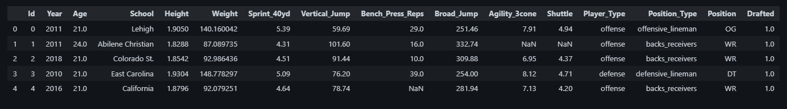
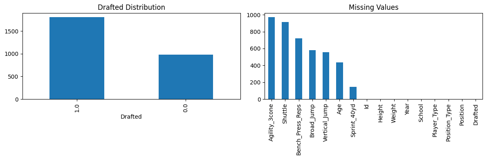
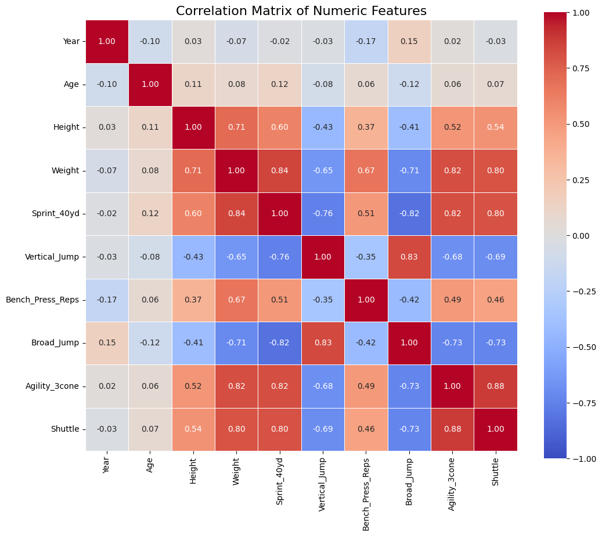

# NFL Draft Pick Prediction

Predicting NFL Draft selections using machine learning, feature engineering, and ensemble learning techniques.

**Notebook:**
[](https://colab.research.google.com/drive/1RfwbskPQbXNsIz0yd5C8jucG8bt7ZVCm#scrollTo=9MyLy3x3RfBj)

---

## Overview

This project explores the application of supervised machine learning techniques to predict NFL draft selections from player combine statistics, physical attributes, collegiate background, and engineered performance metrics.

The project follows a complete machine learning workflow including:

* Data preprocessing
* Exploratory Data Analysis (EDA)
* Feature Engineering
* Feature Selection
* Hyperparameter Optimization
* Ensemble Learning
* Performance Evaluation

The final solution combines multiple gradient boosting and tree-based models through performance-weighted averaging using 5-Fold Cross Validation.

---


## Models

The following models were trained and evaluated using 5-Fold Cross Validation.

| Model         | Validation AUC |
| ------------- | -------------: |
| CatBoost      |     **0.8517** |
| Random Forest |         0.8464 |
| XGBoost       |         0.8412 |
| LightGBM      |         0.8391 |

The final submission uses **performance-weighted ensemble averaging**, where each model contributes proportionally to its validation performance.

Overall Validation AUC:

**0.84 – 0.85**

---

## Techniques Used

* Exploratory Data Analysis
* Missing Value Imputation
* Feature Engineering
* Feature Selection
* Target Encoding
* Hyperparameter Optimization
* 5-Fold Cross Validation
* Performance-Weighted Ensembling
* Gradient Boosting
* Tree-Based Learning

---

## Dataset

The dataset contains NFL prospect information including:

* Physical measurements
* Combine performance
* College information
* Position
* Historical draft outcomes

Data files are located in the `data/` directory.

---

## Project Workflow

```
Raw Dataset
      │
      ▼
Data Cleaning
      │
      ▼
Exploratory Data Analysis
      │
      ▼
Feature Engineering
      │
      ▼
Feature Selection
      │
      ▼
Model Training
      │
      ▼
Hyperparameter Tuning
      │
      ▼
Ensemble Learning
      │
      ▼
Prediction
```

---

### Dataset

<p align="center">
    
</p>

---

### Feature Distribution

<p align="center">
    
</p>

---

### Feature Correlation Matrix

<p align="center">
    
</p>

## Exploratory Data Analysis and Feature Engineering

Several domain-inspired features were created to improve predictive performance.

Engineered features include:

* Explosiveness Index
* Body Mass Index (BMI)
* Power-to-Weight Ratio
* Speed Composite Score
* Agility Composite Score
* School Frequency Encoding
* School Target Encoding
* Missing Value Indicators

These features were combined with preprocessing pipelines and model-specific feature selection techniques.

---


## Repo Structure

```
nfl-draft-prediction/

├── notebook/
│   └── NFL_Draft_Prediction.ipynb
│
├── experiments/
│   ├── feature_engineering.ipynb
│   ├── feature_selection.ipynb
│   ├── hyperparameter_tuning.ipynb
│   └── ensembling.ipynb
│
├── data/
│   ├── train.csv
│   ├── test.csv
│   └── sample_submission.csv
│
├── figures/
│   ├── input.jpg
│   ├── distribution.png
│   └── correlation.png
│
├── output/
│   └── submission.csv
│
├── requirements.txt
└── README.md
```

---

## Tech Stack

**Languages**

* Python

**Libraries**

* Pandas
* NumPy
* Scikit-learn
* XGBoost
* LightGBM
* CatBoost
* Matplotlib

**DevEnv**

* Jupyter Notebook
* Google Colab

---

## Running the Project

Clone the repository.

```bash
git clone https://github.com/shaheer-shamsi/nfl-draft-prediction.git

cd nfl-draft-prediction
```

Install dependencies.

```bash
pip install -r requirements.txt
```

Launch Jupyter Notebook.

```bash
jupyter notebook
```

or open the notebook directly in Google Colab using the badge at the top of this README.

---

## References

* Wes McKinney. *Python for Data Analysis: Data Wrangling with pandas, NumPy, and Jupyter (3rd Edition).* O'Reilly Media, 2022.

* Ethem Alpaydin. *Introduction to Machine Learning (4th Edition).* MIT Press, 2020.

* Google Gemini was used as a search and formatting assistant during the preparation of this project documentation.

---
